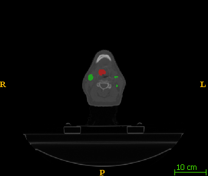

# Transformers for HECKTOR2022 GTV Segmentation

This repository contains transformer models for the HECKTOR 2022 competition, focusing on the segmentation of head and neck gross tumor volume (GTV). The targets are the primary tumor (GTV-T) and involved lymph nodes (GTV-N).

## Transformer Models

The following transformer segmentation networks are experimented with on the HECKTOR2022 competition dataset:

- [x] UNETR++
- [ ] UNETR
- [ ] SWIN Transformer UNet
- [ ] nnFormer

## Data Processing

The "data_processing" directory contains a collection of scripts for an end-to-end DICOM-to-DICOM pipeline.

- `dcm2nii.py`: Converts .dcm images and RTSTRUCTS to .nii.gz image and label files. Fuzzy name matching is used to locate both "GTVt" and "GTVn" within the RTSTRUCT file.
- `bounding_box.py`: Identifies the region of interest within a 192x192x192 bounding box by locating tumors below the brain in the PET image using a thresholding method.
- `resample.py`: Resamples images (CT, PET) and labels (GTV.nii.gz) to 1x1x1 mm^3 isotropic spacing. GTV-T and GTV-N are stored in a single .nii.gz file, with values of 1 for T and 2 for N.
- `resample_ct_test.py`: Similar to `resample.py` but solely resamples CT images.
- `copy_data_for_nnUNet_Task005_CT.py`: A script for data conversion and copying that follows the nnUNet format.
- `nii2dcm.py`: Converts .nii.gz GTV files back to .dcm RTSTRUCT files with the naming convention "AI_GTV_T" and "AI_GTV_N". Both names are rendered in yellow.
